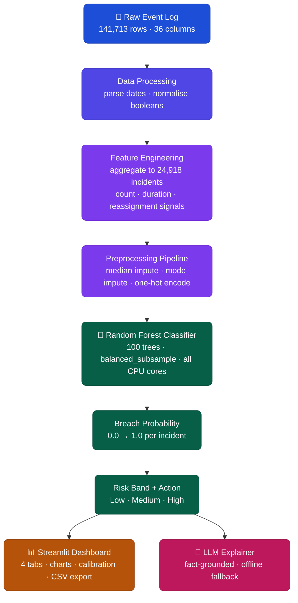

<div align="center">

# 🚦 RiskRadar — IT Incident SLA Breach Risk

**A machine learning decision support tool that predicts SLA breach risk across an entire incident backlog, built from scratch on real ITSM event data.**

[](https://python.org)
[](https://scikit-learn.org)
[](https://streamlit.io)
[](.)
[](.)
[](https://abinashprasana-riskradar-it-incident-sla-risk-app-bvwccq.streamlit.app/)

<br/>

*UCI ML Repository · 141,713 Event Rows · 24,918 Incidents · Random Forest · Built on CPU*

</div>

---

## 🌐 Live App

<div align="center">

[](https://abinashprasana-riskradar-it-incident-sla-risk-app-bvwccq.streamlit.app/)

</div>

The app is deployed on Streamlit Cloud. It loads the full 24,918-incident dataset and trains the model automatically on startup. No account or setup needed.

On first load the model trains in the background, which takes about a minute. After that the dashboard is fully interactive. There is also a sidebar option to score a different event log if needed.

---

## 📖 What This Project Is

When an IT team is staring down 25,000 open tickets, the real challenge is not resolving them. It is knowing which ones to look at first. RiskRadar was built to answer that question. It takes a raw incident event log, aggregates it into incident-level features, and uses a trained Random Forest classifier to assign each ticket an SLA breach probability between 0 and 1. That probability is then mapped to a risk band with a plain-English recommended action so even a non-technical manager can act on it immediately.

The model was trained on the UCI Machine Learning Repository's incident management event log from a real organisation, covering 141,713 event records across 24,918 unique tickets. Everything runs locally with no external APIs required, and the optional LLM explanation layer only summarises facts that are already computed. It cannot invent details.

The project ships with a four-tab Streamlit dashboard where you can filter the full incident list by risk band, drill into any single ticket, explore patterns by assignment group and category, and tune the classification threshold interactively to see how precision and recall trade off.

---

## ⚡ Quick Stats

<div align="center">

| | 🎯 Accuracy | 📈 AUC-ROC | ⚡ F1 (Breach) | 🔢 Incidents | 🌲 Trees |
|:---:|:---:|:---:|:---:|:---:|:---:|
| **Score** | **92.0%** | **0.9674** | **0.886** | **24,918** | **100** |

</div>

---

## 🗃️ Dataset

<div align="center">

| Detail | Value |
|:---|:---|
| 📚 Name | Incident Management Process Enriched Event Log |
| 🌐 Source | UCI Machine Learning Repository |
| 📦 Raw event rows | 141,713 |
| 🎫 Unique incidents | 24,918 |
| 🎯 Target variable | `sla_breached` (derived from `made_sla`) |
| ✂️ Train / Test split | 80% / 20% stratified, seed 42 |
| 🧪 Test set size | 4,984 incidents |

</div>

The raw data is event-level, meaning each row represents a state change on an incident rather than the incident itself. The pipeline aggregates these into one row per ticket, computing counts, durations, and reassignment signals before any modelling happens.

> **Citation:** Amaral, C., Fantinato, M., & Peres, S. (2018). *Incident management process enriched event log* [Dataset]. UCI Machine Learning Repository. https://doi.org/10.24432/C57S4H

---

## 🧠 System Architecture



---

## ⚙️ Model Details

<div align="center">

| Component | Value |
|:---|:---|
| 🏗️ Model type | Random Forest Classifier |
| 🌲 Number of trees | 100 |
| ⚖️ Class balancing | `balanced_subsample` (per-tree rebalancing) |
| 📊 Baseline compared | Logistic Regression (accuracy 90.0%, AUC 0.9589) |
| ✅ Selection criterion | Highest AUC-ROC on held-out test set |

</div>

The pipeline computes five numeric signals per incident (event count, reassignment count, reopen count, resolution hours, and modification count) plus six categorical fields (category, subcategory, priority, assignment group, caller, and location). Missing values are filled before encoding so the model always receives a complete feature vector.

---

## 📊 Evaluation Results

<div align="center">

| Metric | Logistic Regression | Random Forest |
|:---|:---:|:---:|
| 🎯 Accuracy | 90.0% | **92.0%** |
| 📈 AUC-ROC | 0.9589 | **0.9674** |
| ⚡ F1-Score (SLA Breached) | 0.865 | **0.886** |
| ✅ F1-Score (SLA Met) | — | **0.938** |
| 🔍 Precision (Breach) | — | **92.2%** |
| 🔔 Recall (Breach) | — | **85.3%** |

</div>

**Confusion Matrix — Random Forest** (test set: 4,984 incidents)

<div align="center">

| | Predicted Met | Predicted Breached |
|:---:|:---:|:---:|
| **Actual Met** | 3,030 ✅ | 131 ❌ |
| **Actual Breached** | 268 ❌ | 1,555 ✅ |

</div>

The model caught **1,555 out of 1,823 actual SLA breaches**, which works out to an **85% breach recall rate** on unseen data. Only 131 non-breaching incidents were falsely flagged, keeping the false alarm rate low enough to be operationally useful.

---

## 🚦 Risk Band Logic

The model outputs a continuous probability score that gets mapped to three actionable bands. The thresholds were chosen to reflect operational priority levels rather than to maximise any single metric.

<div align="center">

| Risk Band | Probability Range | Recommended Action |
|:---:|:---:|:---|
| 🟢 Low | p < 0.30 | Normal queue. Keep updates clean and avoid unnecessary reassignment. |
| 🟡 Medium | 0.30 ≤ p < 0.60 | Monitor closely. Check for missing details and confirm ownership early. |
| 🔴 High | p ≥ 0.60 | Escalate now. Assign to the right team, reduce reassignment loops, request a senior review. |

</div>

---

## 💻 Dashboard Features

The Streamlit app organises everything into four tabs so different team members can go straight to what they need.

**Tab 1 — Overview (📊)**

Six charts load automatically when the data is ready: a histogram of the full probability distribution, a bar chart and donut showing Low/Medium/High counts and share, a heatmap of priority versus risk band, bar charts of the top 10 riskiest assignment groups and categories by average predicted probability, and a calibration plot comparing predicted probabilities against actual breach rates to verify model reliability. A one-click CSV download exports the full scored incident list.

**Tab 2 — Incident List (📋)**

A filterable and sortable table of all 24,918 incidents. You can filter by risk band, set a minimum probability threshold, search by incident number, sort by probability or reassignment count or reopen count, and control how many rows to show. Every row links through to the detail view.

**Tab 3 — Incident Detail (🧾)**

Select any incident by number and see its breach probability, risk band, recommended action, and up to six computed risk drivers compared against the dataset median and 75th percentile. The optional LLM panel generates a short plain-English explanation using only the facts that are already computed. It cannot invent anything that is not in the row.

**Tab 4 — Model Evaluation (✅)**

An interactive threshold slider from 0.05 to 0.95 recalculates precision, recall, F1, and AUC-ROC live. The confusion matrix updates in step with the slider so you can see exactly what the trade-off looks like at any operating point.

---

## 📁 Project Structure

```
riskradar/
├── 📄 app.py                    Streamlit dashboard — all four tabs and sidebar controls
├── 📄 data_processing.py        Loads the event log CSV, parses dates, normalises boolean fields
├── 📄 feature_engineering.py    Aggregates event-level rows to one row per incident, builds train/test split
├── 📄 model_training.py         Trains Logistic Regression and Random Forest, computes all metrics
├── 📄 run_train.py              Single entry point — runs the full training pipeline end to end
├── 📄 decision_logic.py         Maps probability to risk band and recommended action text
├── 📄 llm_explainer.py          Generates fact-grounded explanation via OpenAI, with offline fallback
├── 📄 requirements.txt          Python dependencies
├── 📄 runtime.txt               Pins Python 3.11 for Streamlit Cloud deployment
├── 📄 RiskRadar_Report.ipynb    Notebook with design rationale and architecture walkthrough
└── 📦 incident_event_log.csv    Raw event log from UCI repository (45 MB, 141,713 rows)
```

---

## ⚙️ How to Run

**1. Clone the repository**
```bash
git clone https://github.com/abinashprasana/riskradar-it-incident-sla-risk.git
cd riskradar-it-incident-sla-risk
```

**2. Create a virtual environment**
```bash
python -m venv .venv
```

Windows:
```bash
.venv\Scripts\Activate.ps1
```

Mac / Linux:
```bash
source .venv/bin/activate
```

**3. Install dependencies**
```bash
pip install -r requirements.txt
```

**4. Launch the dashboard**
```bash
streamlit run app.py
```

Open `http://localhost:8501` in your browser. The dataset loads automatically and the model trains on first launch (takes about a minute). Subsequent visits are instant.

There is also a sidebar option to upload a different event log CSV if you want to score your own dataset.

<details>
<summary>⚙️ Retrain the model from scratch</summary>

To reproduce the full training run or experiment with different hyperparameters:

```bash
python run_train.py
```

This loads the event log, runs feature engineering, trains both Logistic Regression and Random Forest, evaluates both, and saves the better model to `best_model.joblib`.

</details>

<details>
<summary>🔑 Enable LLM explanations</summary>

By default the Incident Detail tab shows a template-based explanation that works without any API key. To enable the GPT-powered version:

```bash
# Windows
setx OPENAI_API_KEY "your_key_here"

# Mac / Linux
export OPENAI_API_KEY="your_key_here"
```

Then restart the terminal and run `streamlit run app.py` again. The LLM only summarises facts already in the incident row. It cannot hallucinate incident details.

</details>

---

## 🎥 Demo

https://github.com/user-attachments/assets/b49adc74-d1b8-49e3-b63d-4d563a4166a0

---

## ⚠️ Limitations

This is a prototype decision support tool, not a production-hardened system. A few things are worth knowing before drawing conclusions from the outputs.

The model was trained on data from a single organisation, so predictions on a different organisation's incidents would require retraining on that environment's history. The features rely on specific column names from the UCI dataset schema, so adapting the pipeline to a different ITSM export means updating the feature engineering step. Retraining will produce slightly different results because of random splits and tree construction, though AUC-ROC should remain in a similar range. A real deployment would also need access controls, audit logging, and ongoing monitoring to catch data drift.

<div align="center">

| 🔧 Possible Improvement | 📈 Expected Effect |
|:---|:---|
| Gradient boosting (XGBoost or LightGBM) | Typically gains 1 to 2 percentage points on AUC over Random Forest |
| Hyperparameter search (GridSearchCV) | Better optimised tree depth and feature count |
| Time-aware train/test split | More realistic evaluation that respects temporal order |
| Feature importance explanations in UI | Shows which features drove each individual prediction |
| REST API wrapper | Enables real-time scoring from a ServiceNow webhook |

</div>

---

## 👤 Author

**Abinash Prasana Selvanathan**

*If you found this useful, feel free to star the repo.*
