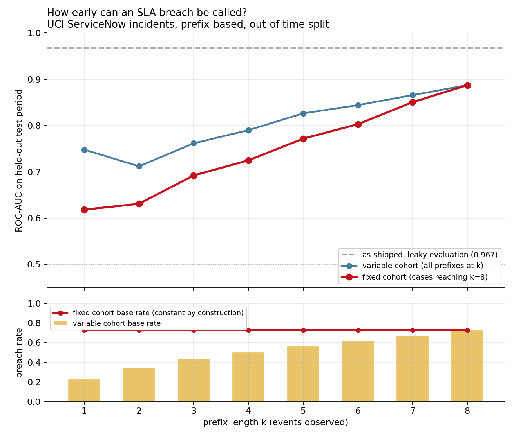
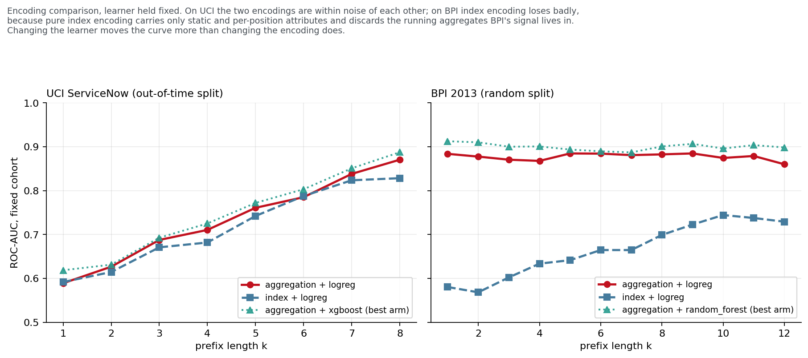

<div align="center">

# 🕰️ KAIROS — Incident SLA Breach Risk, Scored Early

**Ranking a live IT incident queue by SLA-breach risk from partial information, and measuring how early that call can be trusted.**

[](https://web-azx5.vercel.app/)
[](https://python.org)
[](https://scikit-learn.org)
[](https://pytorch.org)
[](tests/)
[](reports/)

<br/>

*UCI ServiceNow · BPI Challenge 2013 (Volvo IT) · prefix-based · out-of-time evaluation · CPU only*

</div>

---

## 📖 What this project is

A service desk lead looking at an open queue has a question that no accuracy figure answers: *which of these is going to miss its SLA, and do I know that yet?* KAIROS is my attempt to answer both halves properly.

Most tabular write-ups of this problem score one row per **finished** ticket. That is a post-mortem. It uses columns like total event count and resolution time, which only exist once the case is already closed, so the model is reading the answer rather than predicting it. KAIROS instead treats every incident as a sequence and produces one row for each point along it: after the first event, after the first two, and so on. Each row carries only what the service desk could actually see at that moment. Counters hold their running values. Time is time elapsed so far.

The output is a curve: prediction quality as a function of how much of an incident you have observed. On the UCI ServiceNow log, held out over time, the model ranks at **0.619** with a single event visible and **0.887** by the eighth. Somewhere around the fifth or sixth event it crosses into territory where acting on the score beats guessing, and that crossing point is the useful output.

The name is the Greek word for the opportune moment, as distinct from *chronos*, clock time. The whole study is about which of the two you are actually measuring.

### In short

**The problem.** SLA breaches are usually spotted once the ticket is already late, and by then escalating does little.

**Who it's for.** Whoever triages the open queue and has to decide, this morning, which tickets get a senior engineer.

**What people do today.** SLA timers show how much time is left, not how likely the ticket is to miss. The usual ML write-up trains on closed tickets. The first version of this project did exactly that and scored 0.967 AUC, but it was reading columns like total event count and resolution time that don't exist until the ticket is finished.

**What I found.** The log fills in closing fields on every row, so `closed_code` is already there at the first event and on its own moves the breach rate between 0.25 and 0.64 across the common codes. Take that away and score honestly, and the real answer is a curve: 0.619 at one event, 0.887 at eight, worth acting on from about the fifth.

**What I built.** A model that scores every incident after every event using only what was visible at that moment, tested on a later period than it trained on, with calibration, conformal sets and a cost-based alarm on top so the score turns into a decision.

**See it.** The [live explorer](https://web-azx5.vercel.app/) re-ranks 478 real held-out incidents as you drag through time. `python scripts/run_all.py` rebuilds every number from the raw logs.

One command takes it from raw event log to figures, on CPU, with no GPU anywhere in the pipeline.

---

## 🎬 Live demo

[](https://web-azx5.vercel.app/)

**https://web-azx5.vercel.app/**

No setup needed. The earliness curve draws against scroll with its bootstrap intervals, a WebGL field runs behind the hero, and the explorer lets you drag a slider for `k` and watch 478 real held-out incidents re-rank on their actual model scores.

The site lives in `web/`, a Next.js 16 static export. Every figure it shows is read from `web/public/data/*.json`, which `scripts/export_web_data.py` writes straight out of `artifacts/`. Nothing on the page is typed by hand, so a pipeline re-run propagates and the site cannot drift from what the experiments reported.

To run it locally:

```bash
cd web && npm install && npm run build && npx serve out
```

---

## ⚡ Quick stats

<div align="center">

|  | 📉 Fixed-cohort AUC, k=1 | 📈 Fixed-cohort AUC, k=8 | 🎫 Incidents | 🔢 Scored moments | 🧪 Tests |
|:---:|:---:|:---:|:---:|:---:|:---:|
| **UCI ServiceNow** | **0.619** | **0.887** | **23,102** | **81,449** | **77** |

</div>

---

## 🗃️ Datasets

<div align="center">

| | UCI ServiceNow | BPI Challenge 2013 (Volvo IT) |
|:---|:---|:---|
| 📚 Cases / events | 24,918 / 141,712 | 7,554 / 65,533 |
| ✂️ Cases used | 23,102 | 7,545 |
| 🏷️ Label | native `made_sla` flag | constructed: duration > 240 h |
| 📊 Breach rate | 0.382 | 0.310 |
| 🔀 Split | out-of-time, straddlers dropped | random at case level |
| 🪟 k_max | 8 | 12 |
| 📅 Period | March–May 2016 | 2010–2012 |

</div>

The UCI split holds out everything after **2016-05-05 15:00:15**: 9,602 training cases, 2,881 validation, 1,920 calibration, 5,707 test. Another 2,718 cases straddled the boundary and were dropped, because a case still running when the test period opens has already leaked part of its future into training.

**BPI 2013 arrives in a burst and runs long, which is why it is split differently.** Its event timestamps span 2010 to 2012, but the middle half of its cases *start* inside a six-day window (2012-04-27 to 2012-05-03) while the median case runs 181 hours. Arrivals that tight against durations that long mean any chronological boundary cuts through a large share of open cases: applying the same split function used for UCI discards **1,456 of 5,658** modelling cases as straddlers, against **2,718 of 17,121** on UCI. So BPI uses a documented random case-level split, still keeping a case's prefixes inside one fold, and makes no out-of-time claim.

Its 240-hour deadline is a stated policy constant rather than a fitted quantile, and it should never be presented as though the dataset shipped an SLA field. A constant also matches how service targets actually work: an SLA is a policy someone wrote down, not a percentile of last quarter.

> Amaral, C., Fantinato, M., & Peres, S. (2018). *Incident management process enriched event log* [Dataset]. UCI Machine Learning Repository. https://doi.org/10.24432/C57S4H
>
> Steeman, W. (2013). *BPI Challenge 2013, incidents* [Dataset]. 4TU.ResearchData. https://doi.org/10.4121/500573e6-accc-4b0c-9576-aa5468b10cee

---

## 🧠 How it works


```mermaid
flowchart TD
    classDef io    fill:#1d4ed8,color:#fff,stroke:#1e40af,rx:8
    classDef prep  fill:#4f46e5,color:#fff,stroke:#4338ca,rx:8
    classDef guard fill:#b45309,color:#fff,stroke:#92400e,rx:8
    classDef model fill:#7c3aed,color:#fff,stroke:#6d28d9,rx:8
    classDef eval  fill:#065f46,color:#fff,stroke:#064e3b,rx:8

    A["📄  Raw event log<br/>ServiceNow CSV · VINST CSV"]:::io
    B["Adapter<br/>canonical case / activity / timestamp<br/>+ declared feature whitelist"]:::prep
    C["Prefix log<br/>one row per k = 1..K per case<br/>features from the first k events only"]:::prep
    D["🔒  Leakage screen<br/>constant-rate · future-reference · k=1 AUC<br/>assert_no_leakage raises, it does not warn"]:::guard
    E["Out-of-time split<br/>train · val · calib · test<br/>straddling cases removed"]:::guard
    F["Encoding<br/>aggregation, single bucket<br/>(index encoding runs as a control)"]:::prep

    A --> B --> C --> D --> E --> F --> G

    subgraph G["🧮  Model and decision layer"]
        direction TB
        M1["Candidate learners<br/>logreg · random forest · XGBoost<br/>chosen on validation, never on test"]:::model
        M2["Random search, 60 configs<br/>fit on train · scored on val"]:::model
        M3["Calibration on its own fold<br/>Platt · isotonic · beta · prior shift"]:::model
        M4["Mondrian split conformal<br/>label sets at 80 / 90 / 95%"]:::model
        M5["Cost-sensitive alarm<br/>one alarm per incident, threshold tuned on val"]:::model
        M1 --> M2 --> M3 --> M4 --> M5
    end

    G --> H["📊  Per-k evaluation<br/>fixed and variable cohorts<br/>1000-resample bootstrap intervals"]:::eval
    H --> I["📈  Figures · artifacts · KAIROS web export"]:::io
```

Features are **whitelisted, never blacklisted**. A model sees a column only when an adapter has handed it over on purpose, because the leaks in this log are not the ones you would think to exclude. More on that below.

---

## 📊 Evaluation results



| Log | Arm | ROC-AUC |
|:--|:--|--:|
| UCI | As shipped: whole-trace features, random split, model picked on test | 0.9674 |
| UCI | Prefix-based, out-of-time, one decision per ticket at k=1 | 0.7482 |
| UCI | Prefix-based, out-of-time, **fixed cohort k=1** | **0.6185** |
| UCI | Prefix-based, out-of-time, **fixed cohort k=8** | **0.8874** |
| UCI | Tuned, 60 configs on validation, fixed cohort k=1 → k=8 | 0.6245 → 0.8883 |
| UCI | Random case split *(ablation)*, fixed cohort k=1 → k=8 | 0.7437 → 0.9362 |
| BPI 2013 | Random split, fixed cohort k=1 → k=12 | 0.9124 → 0.8983 |

**Two cohorts are reported and only one of them answers the question.** The *variable* cohort uses every prefix available at each `k`, which is what a real queue looks like. But its base rate climbs from 0.232 to 0.730 across k=1..8 as short cases close and leave, so that curve rises even for a model that learned nothing. The *fixed* cohort restricts to the 478 cases long enough to reach `k_max` and holds the population constant, so a change in AUC there is a change in what the model knows. Both are on the chart because the distinction has to be visible for either curve to mean anything.

**What honest evaluation costs.** Switching UCI to a random case split inflates fixed-cohort AUC by **+0.125 at k=1** and **+0.049 at k=8**. That is what the out-of-time protocol costs, as a number you can point at.

---

## 🔍 What the audit found

**The UCI log is a snapshot export of closed tickets, not an event stream.** Closure fields are back-filled onto every row of a trace. At the *first* event of each case:

| Column | Populated at k=1 | Equals the case-final value |
|:--|--:|--:|
| `closed_at` | 100.0% | 100% |
| `closed_code` | 99.6% | 100% |
| `resolved_by` | 99.6% | 100% |
| `resolved_at` | 93.8% | 100% |

Knowing `closed_code` at event 1 splits the breach rate from 0.000 (code 12) to 0.814 (code 15). Those two extremes are thin, at 2 and 43 cases, so here is the same thing without the tails: across every code with at least 100 cases the rate still runs 0.253 to 0.637 against a population rate of 0.382. A field that is 99.6% populated at the first event and already holds its final value is a worse leak than the SLA flag itself, and it survives casual inspection. Hence the whitelist.

**There is heavy concept drift.** Monthly breach rate runs **0.642 in March, 0.243 in April, 0.234 in May**. Case start time alone separates the outcome at AUC 0.708 under in-sample target encoding, and a random split hands that to the model for free.

**Dropping terminal-only cases costs something.** 1,816 cases (7.3%) consist solely of `Resolved` / `Closed` events and leave the study. Their breach rate is 0.163 against 0.382 for the cases retained, which is a selection effect large enough to belong in the write-up.

---

## 🔬 Beyond the curve

Four questions an AUC leaves open. Each was measured, and two of the four came back against the interesting answer.

<details>
<summary><b>📐 Calibration: a held-out fold has to resemble the period you deploy into</b></summary>

<br/>

Post-hoc calibration is supposed to be free. On UCI it makes things **worse**, and one pair of numbers explains why: the calibration fold breaches at **0.583** while the test period breaches at **0.396**. A calibrator fitted on the first learns a correction the second does not need.

| Variable cohort, ECE | UCI (drifting) | BPI (stable) |
|:--|--:|--:|
| uncalibrated | 0.053 | 0.059 |
| Platt | 0.080 | 0.042 |
| isotonic | 0.097 | 0.041 |
| beta | 0.092 | 0.038 |

Same code, same calibrators, opposite outcomes. BPI is split at random so its calibration fold matches deployment, and there every calibrator behaves as the textbook says. Even a prior shift using the **true** test prior leaves UCI at ECE 0.104, so the residual was never a prior problem. The Saerens–Latinne–Decaestecker EM estimate puts the test prior at 0.220 against an actual 0.396, which is its own quiet result about EM under this much drift.

</details>

<details>
<summary><b>🔤 Does event order carry signal? Measured before building a model for it</b></summary>

<br/>

Aggregation encoding throws away the order of events, and the usual next move is to reach for a sequence model. Before writing any PyTorch I target-encoded the ordered activity sequence against the same activities **sorted**, cross-fitted so a rare sequence cannot memorise its own label. The gap between them is what an order-aware model could buy.

| Log | Cross-fitted Δ | In-sample Δ |
|:--|--:|--:|
| UCI | **+0.0001** | +0.0112 |
| BPI 2013 | +0.0058 | +0.0616 |

UCI's activity vocabulary is six symbols and the median case uses one of them across three events. There is no order to learn. The in-sample column is the same test without cross-fitting. The distance between the two columns is why the question needed an experiment and not an opinion.

A 31,526-parameter GRU over the raw event stream, five seeds, confirms it at the model level: test AUC **0.788 ± 0.008**, which is **−0.035** against the tuned gradient-boosted baseline. The seed spread is four times smaller than the gap, so the sequence model is genuinely losing on this log.

</details>

<details>
<summary><b>🎯 Conformal coverage puts a number on how far the log has moved</b></summary>

<br/>

Mondrian split conformal turns a score into a label set that should contain the truth at a stated rate. Its guarantee assumes exchangeability, which an out-of-time split deliberately breaks.

| Nominal | Actual | Shortfall |
|--:|--:|--:|
| 95.0% | 89.9% | −5.1 pp |
| 90.0% | 84.0% | −6.0 pp |
| 80.0% | 68.5% | −11.5 pp |

Coverage falls short at every level and the shortfall widens as the bar drops. The implementation is doing what it says; the assumption underneath it is what the split removes, so the gap reads directly as distance between the calibration fold and the test period. Prefix lengths 6 to 8 share one calibration bin: taken separately they hold 141, 73 and 46 negatives, too few to estimate a 90% quantile from.

</details>

<details>
<summary><b>💰 The cost assumption moves the answer more than the model does</b></summary>

<br/>

An AUC does not tell a team lead what to do. The alarm layer fires once per incident, at the first prefix crossing a threshold tuned on the validation fold, under a stated cost model.

| At c_i/c_b = 0.1, effectiveness = 0.5 | Value |
|:--|--:|
| threshold τ* | 0.50 |
| mean cost per case | **1.661** |
| never alarm | 2.320 |
| always alarm at k=1 | 2.160 |
| mean alarm prefix | k = 2.69 |
| recall / precision | 0.823 / 0.646 |

Across 24 combinations of escalation cost and intervention effectiveness the model beats the better trivial policy in **17**, and loses in the other seven, all of them where escalation costs nearly as much as the breach it prevents. The chosen threshold ranges **0.10 to 0.98** across those assumptions. That range is the honest headline: what you believe escalation costs drives this decision more than the classifier does.

</details>

---

## 🧪 Encoding comparison



Both Teinemaa et al. combinations are implemented: **aggregation encoding with a single bucket**, and **index encoding with prefix-length bucketing**, one model per `k` with each event position given its own columns so ordering survives. Learner held fixed at logistic regression, fixed-cohort AUC:

| Log | Encoding | k=1 | k_max |
|:--|:--|--:|--:|
| UCI | aggregation | 0.589 | 0.870 |
| UCI | index | 0.592 | 0.828 |
| BPI 2013 | aggregation | 0.884 | 0.860 |
| BPI 2013 | index | 0.580 | 0.729 |

On UCI the two track each other until the right-hand end, where aggregation pulls ahead by 0.038. On BPI index encoding loses heavily at every `k`, and the cause is concrete: pure index encoding carries static plus per-position attributes and discards the running aggregates. UCI has 13 static case attributes that both arms share, so losing the aggregates costs little. BPI has two, so they are most of its signal.

This replicates the benchmark finding that aggregation encoding with a single bucket is a strong baseline that more elaborate schemes do not reliably beat, which is why the headline arm uses it.

---

## 📁 Project structure

```
riskradar/
├── 📄 logspec.py              LogSpec + the feature whitelist (single source of truth)
├── 📂 adapters/
│   ├── uci_servicenow.py      ServiceNow log → canonical event frame; native SLA label
│   └── bpi2013.py             VINST CSV → canonical event frame; constructed 240h label
├── 🧩 prefix_log.py           prefix construction, leakage_screen, assert_no_leakage
├── ✂️ splitting.py            out-of-time split, straddle removal, random-case fallback
├── 🔠 encoding.py             aggregation + index encoding, preprocessing pipeline
├── 🤖 models.py               candidates, single-bucket and per-prefix-length training
├── 🎛️ tuning.py               random search: fit on train, score on val
├── 📐 calibration.py          Platt · isotonic · beta · EM prior estimation
├── 🎯 conformal.py            Mondrian split conformal, pooled bins for sparse k
├── 🚨 alarm.py                cost model, first-alarm policy, threshold sweep
├── 🔥 torch_seq.py            PrefixGRU, the sequence-model control
└── 📊 evaluation.py           per-k metrics, bootstrap CIs, fixed/variable cohorts

scripts/
├── 🚀 run_all.py              21 steps, every arm in order, CPU only
├── run_leaky_baseline.py      reproduces the as-shipped 0.9674 from the original modules
├── run_experiment.py          one arm: --log / --encoding / --split-mode / --learner / --tune
├── run_calibration.py         calibration under label shift
├── run_order_ablation.py      cross-fitted order-signal test
├── run_gru.py                 sequence-model control, 5 seeds
├── run_conformal.py           coverage report
├── run_error_analysis.py      error groups + SHAP by prefix length
├── run_alarm.py               cost sweep, 24 cells
├── make_figures.py            figures + headline table
└── export_web_data.py         artifacts → web/public/data/*.json

web/                           KAIROS, the Next.js presentation layer
tests/                         77 tests: leakage, folds, encoding, cohorts, CIs, calibration
docs/MODEL_CARD.md             intended use, limitations, what these numbers cannot claim
artifacts/                     per-run metrics.json, per_k.csv, run_config.json
reports/                       figures and headline_comparison.csv
```

`app.py` was version 1 of this project and is now retired: it retrained a leaky model at startup and reported in-sample metrics as though they were held out. It prints an explanation and exits. The original implementation is preserved at `app_v1_legacy.py.bak`, and `run_leaky_baseline.py` imports the untouched original modules directly, so the 0.9674 baseline is the real prior result and not a strawman built to lose.

---

## ⚙️ How to run

**1. Clone and install**
```bash
git clone https://github.com/abinashprasana/riskradar-it-incident-sla-risk.git
cd riskradar-it-incident-sla-risk
python -m venv .venv
.venv\Scripts\Activate.ps1        # Windows PowerShell; use source .venv/bin/activate elsewhere
pip install -e ".[dev]"
```

**2. Get the data**

Put `incident_event_log.csv` (UCI) in the repository root, and the BPI Challenge 2013 CSV export at `csv_files/VINST cases incidents.csv`. Both citations are above. Paths are set in `DEFAULT_PATHS` at the top of `scripts/run_experiment.py` if you keep the files elsewhere.

**3. Run everything**
```bash
python scripts/run_all.py
```

Twenty-one steps on CPU, the two 60-config tuning arms being much the slowest. Afterwards `reports/` holds the figures and `headline_comparison.csv`, `artifacts/` holds one directory per arm, and `web/public/data/` is refreshed.

**4. Run the tests**
```bash
python -m pytest tests/ -q
```

The suite is a guard rail, not decoration. It asserts that no forbidden column reaches the feature matrix, that the leakage screen catches the back-filled timestamps, that train/val/calib/test are disjoint at both case and prefix level, that no training case is still running when the test period begins, and that the fixed cohort really does hold its population constant.

<details>
<summary>⚙️ Run individual steps</summary>

```bash
# One arm, any combination
python scripts/run_experiment.py --log uci_servicenow --encoding agg --tune 60

# The as-shipped baseline, from the original v1 modules
python scripts/run_leaky_baseline.py

# Calibration, conformal, alarm
python scripts/run_calibration.py --log uci_servicenow
python scripts/run_conformal.py   --log uci_servicenow
python scripts/run_alarm.py       --log uci_servicenow

# The sequence-model control (not part of run_all.py; needs torch)
python scripts/run_gru.py --log uci_servicenow --seeds 5

# Figures and the web export
python scripts/make_figures.py
python scripts/export_web_data.py
```
</details>

---

## ⚠️ Limitations

This is a study on two public logs, not a product. A few things to know before drawing conclusions from the numbers.

**One organisation per log.** Nothing here transfers to another service desk without refitting, and the two logs disagree about enough that I would not assume a third behaves like either.

**The fixed cohort is small.** 478 UCI test cases reach k=8, so the right-hand end of the curve is noisier than the left. Several comparisons on this page are narrower than their own bootstrap intervals and are reported as ties.

**Early scores rank far better than they calibrate.** On the fixed cohort the expected calibration error is 0.425 at k=1, still 0.253 at k=4, and only reaches 0.067 by k=8. The bias runs the same way, from −0.41 to −0.01. Use these scores to order a queue. They do not become usable as literal probabilities until the right-hand end of the curve.

**`num__elapsed_h` is doing something other than what its name suggests.** At k=1 its median is 0.0 hours yet it scores AUC 0.654 on its own, which is almost certainly creation channel rather than urgency. A ticket raised by a self-service portal and one raised by phone differ in more than elapsed time. It is legally as-of-k so it stays, but it should not be read causally.

**BPI's numbers answer a narrower question.** Random split, constructed deadline. It is a control for the method, not a second headline. The straddle rate that motivated the random split is 25.7% against UCI's 15.9%, a real difference but not a decisive one, so that choice is worth re-examining.

**Survival analysis was considered and rejected, not overlooked.** Every UCI incident reaches `Closed` with zero null `closed_at`. The 1,556 missing `resolved_at` values are a data-quality artefact of a back-filled field. Censoring needs cases in flight at the cutoff, and there are none.

**These numbers may not be used to claim a benchmark win.** No comparison against a published result on either log is made, and the honest figures are lower than the original 0.9674 by design.

Full detail, including governance and intended use, is in [`docs/MODEL_CARD.md`](docs/MODEL_CARD.md).

---

## 📚 Method references

- Teinemaa, Dumas, La Rosa & Maggi (2019). Outcome-Oriented Predictive Process Monitoring: Review and Benchmark. *ACM TKDD* 13(2). https://doi.org/10.1145/3301300
- Weytjens & De Weerdt (2021). Creating Unbiased Public Benchmark Datasets with Data Leakage Prevention for Predictive Process Monitoring. *BPM Workshops*, LNBIP 436, 18–29. https://doi.org/10.1007/978-3-030-94343-1_2
- Saerens, Latinne & Decaestecker (2002). Adjusting the Outputs of a Classifier to New a Priori Probabilities. *Neural Computation* 14(1), 21–41. https://doi.org/10.1162/089976602753284446
- Fahrenkrog-Petersen, Tax, Teinemaa, Dumas, de Leoni, Maggi & Weidlich (2022). Fire Now, Fire Later: Alarm-Based Systems for Prescriptive Process Monitoring. *KAIS* 64, 559–587. https://doi.org/10.1007/s10115-021-01633-w

---

## 👤 Author

**Abinash Prasana Selvanathan**

*If this was useful, a ⭐ on the repo is welcome.*
